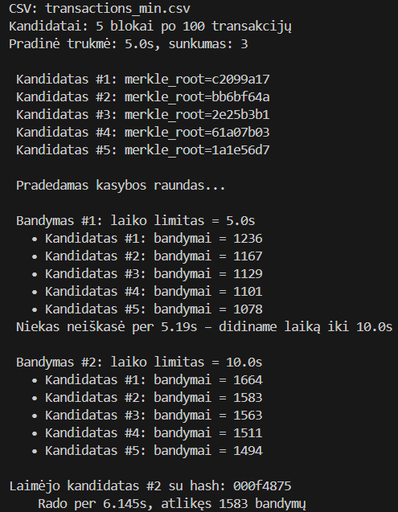
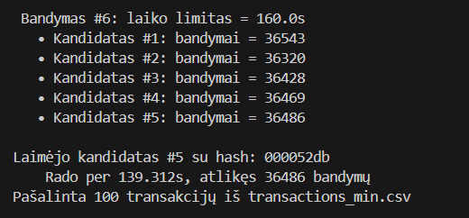

# Mano Blockchain

Šis projektas yra supaprastinta blokų grandinės (blockchain) implementacija. Jis skirtas pademonstruoti pagrindinius blockchain principus, tokius kaip **UTXO modelį**, **Merkle medžio struktūrą**, **Proof-of-Work (PoW)**, bloko kasybą bei blokų grandinės formavimą. Taip pat siekiama geriau suprasti, kaip veikia blokų grandinės, jų struktūra ir duomenų saugumas.

## Turinys

1. Projekto aprašymas
2. Architektūra
3. Funkcijos
4. Naudojimo instrukcijos
5. Įdomesni sprendimai
6. Lygiagretus kasimo procesas
7. Dirbtinio intelekto pagalba
8. Išvados

## Projekto aprašymas

Šis projektas simuliuoja pagrindinius blokų grandinės veikimo etapus. Pradedant nuo vartotojų generavimo, iš kurių toliau formuojamos transakcijos naudojant UTXO (Unspent Transaction Output) modelį. Šios transakcijos grupuojamos į blokus, kurie kasami (Proof-of-Work mechanizmu) ir įtraukiami į grandinę. Kiekvienas blokas patvirtinus atnaujina vartotojų balansus ir pašalina įtrauktas transakcijas iš sąrašo. Procesas kartojamas tol, kol nelieka transakcijų.

## Architektūra

Projektas yra suskirstytas į atskirus Python failus, kurių kiekvienas atsakingas už specifinę blokų grandinės dalį:

- `user.py`: Vartotojo duomenų modelis.
- `user_generator.py`: Vartotojų generavimas ir išsaugojimas.
- `my_hash_function.py`: Mano kurta maišos funkcija.
- `transaction_generator.py`: Transakcijų kūrimas ir valdymas naudojant UTXO modelį.
- `block_body.py`: Transakcijų parinkimas ir balansų atnaujinimas.
- `merkel_root2.py`: Merkel medžio ir Merkel root skaičiavimas.
- `Body.py`: Bloko turinio apibrėžimas.
- `Header.py`: Bloko antraštės apibrėžimas.
- `main.py`: Blokų generavimas, kasyba ir grandinės formavimas.
- `procesas.py`: atliekamas lygiagretus kasimo procesas.

## Funkcijos

1. Vartotojų generavimas:

    - **Failas:** `user_generator.py`
    - **Aprašymas:** Sukuria atsitiktinius vartotojus, kurių kiekvienas turi vardą, unikalų viešąjį raktą (public_key) ir atsitiktinį pradinį balansą (nuo 100 iki 1 000 000).
    - **Išvstis:** Vartotojų sąrašas išsaugomas `users.txt` faile.

    ```
    users.txt
    Name                           PublicKey       Balance
    ------------------------------------------------------
    #1 Domas Bublys                49b31a5d        233,903
    #2 Algirdas Paulauskas         d1d4a469        153,978
    #3 Linas Stankevičius          d2ccb45f        588,454
    #4 Kęstutis Baronas            716b1a72        853,708
    #5 Jokubas Petraitis           cc49239f        288,321
    #6 Fabrielius Vilkas           ee8f160e        698,532
    ...
    ```

2. Transakcijų Generavimas (UTXO Modelis):

    - **Failas:** `transaction_generator.py`
    - **Aprašymas:** Sukuria naujas transakcijas, remiantis UTXO modeliu, ir priskiria jas vartotojams.
    - **Išvstis:** `transactions.txt` (detalus) ir `transactions_min.csv` (supaprastintas).

    **transactions.txt**
    ```txt
    ...
    [Transaction #00015]
    Transaction ID: 785e0435

    Inputs:
    (0) TX #00002 → #6 Fabrielius Vilkas : 18769

    Outputs:
    (0) #1 Domas Bublys : 12973
    (1) #6 Fabrielius Vilkas : 5796 (change)

    ---------------------------------------------------

    [Transaction #00016]
    Transaction ID: a5c4995c

    Inputs:
    (0) TX #00015 → #6 Fabrielius Vilkas : 5796
    (1) TX #00011 → #6 Fabrielius Vilkas : 131472

    Outputs:
    (0) #4 Kęstutis Baronas : 87398
    (1) #6 Fabrielius Vilkas : 49870 (change)
    ...
    ```

    transactions_min.csv
    ```csv
    ...
    785e0435,ee8f160e,49b31a5d,12973,3a51d5bb:1
    a5c4995c,ee8f160e,716b1a72,87398,785e0435:1;044b02ba:0
    ...
    ```

3. Bloko Formavimas:

    - **Failas:** `block_body.py`, `Body.py`, `merkel_root2.py`
    - **Aprašymas:** Iš transakcijų sąrašo (transactions_min.csv) atsitiktinai pasirenkamos transakcijos. Iš šių transakcijų suformuojamas bloko turinys ir apskaičiuojama Merkel medžio šaknis (merkel_root), kuri yra visų transakcijų maišos santrauka.

    chain.json
    ```json
    ...
    "merkle_root": "e1e8908d",
      "merkle_tree_levels": [
        {
          "level": 0,
          "count": 5,
          "hashes": [
            "a5c4995c",
            "84b2e5bb",
            "297322db",
            "ad962bed",
            "eb94b76f"
          ]
        }
  
    ```

4. Bloko Kasyba (Proof-of-Work):

    - **Failas:** `Header.py`
    - **Aprašymas:** Bloko antraštė (BlockHeader), apimanti ankstesnio bloko hash (prev_hash), laiko žymę (timestamp), versiją (version), Merkle šaknį (merkle_root), „nonce“ ir sudėtingumą (difficulty), yra maišoma (hash). Tikslas yra rasti tokį nonce skaičių, kad sugeneruotas bloko hash prasidėtų bent trimis nuliais (000...).

    chain.json
    ```json
    ...
    "header": {
      "prev_hash": "00051650",
      "timestamp": 1762364231,
      "version": 1,
      "merkle_root": "e1e8908d",
      "nonce": 347,
      "difficulty": 3,
      "serialize": "00051650|1762364231|1|e1e8908d|347|3 ---> 000ab33a"
    }
    ...
    ```
    
5. Bloko Patvirtinimas ir Įtraukimas:

    - **Failas:** `main.py`, `block_body.py`
    - **Aprašymas:** Kai blokas yra sėkmingai iškasamas ir patvirtintas (tinkamas Proof-of-Work), įvykdomi šie veiksmai:
        - **Transakcijų pašalinimas:** Į bloką įtrauktos transakcijos pašalinamos iš transactions_min.csv, kad nebūtų pakartotinai naudojamos.
        - **Balansų atnaujinimas:** Vartotojų balansai faile users.txt yra atnaujinami pagal įvykdytas transakcijas.
        - **Įtraukimas į grandinę:** Naujas blokas pridedamas prie blokų grandinės.

6. Grandinės Formavimas:

    - **Failas:** `main.py`
    - **Aprašymas:** Kiekvienas naujas blokas naudoja ankstesnio bloko hash (prev_hash) kaip nuorodą, užtikrindamas grandinės vientisumą. Procesas tęsiasi tol, kol nelieka jokių transakcijų, kurias būtų galima įtraukti į blokus.

7. Lygiagretus Kasimo Procesas:

    - **Failas:** `procesas.py`
    - **Aprašymas:** Sistema, kuri kasa kelis blokus vienu metu, naudodama kelis procesus (multiprocessing). Vietoj to, kad kasytume vieną bloką po kito, kiekvienas kandidatas kasa lygiagrečiai savo procese. Kai kuris nors kandidatas pirmas atitinka Proof-of-Work reikalavimus, jis laikomas laimėtoju, o kiti kasimo procesai sustabdomi.

## Naudojimo instrukcijos

**Paleidimas:**

1. Generuokite vartotojus:

    ```bash
    python.exe user_generator.py
    ```
    Tai sukurs `users.txt` failą.

2. Generuokite transakcijas:

    ```bash
    python.exe transaction_generator.py users.txt
    ```
    Tai sukurs `transactions.txt` ir `transactions_min.csv` failus.

3. Kasikite blokų grandinę:

    ```bash
    python.exe main.py transactions_min.csv users.txt
    ```
    Tai atnaujins `users.txt` ir išsaugos pilną grandinę į `chain.json`.
    
    Taip galima paleisti tik vieno bloką.
    
    ```bash
    python.exe main.py transactions_min.csv users.txt single
    ```
    Tai sukurs `block.txt` failą su vieno bloko informacija.

4. Atliekamas lygiagretus kasimo procesas:

    ```bash
    python.exe procesas.py transactions_min.csv 5 3
    ```
    Tai sukurs 5 kandidatus, o difficulty bus 3 (bloko hash turi prasidėti trimis nuliais).

## Įdomesni sprendimai

**Merkle Medžio Detalizavimas:** Be Merkle root skaičiavimo, sistema gali išsaugoti ir visus Merkle medžio lygius, o tai padeda vizualizuoti ir patikrinti bloko transakcijų vientisumą.

chain.json
```json
...
"body": {
      "merkle_root": "e1e8908d",
      "merkle_tree_levels": [
        {
          "level": 0,
          "count": 5,
          "hashes": [
            "a5c4995c",
            "84b2e5bb",
            "297322db",
            "ad962bed",
            "eb94b76f"
          ]
        },
        {
          "level": 1,
          "count": 3,
          "hashes": [
            "62071ac2",
            "1dd4b7b7",
            "d884f110"
          ]
        },
        {
          "level": 2,
          "count": 2,
          "hashes": [
            "5bbb4db5",
            "c5f3ea02"
          ]
        },
        {
          "level": 3,
          "count": 1,
          "hashes": [
            "e1e8908d"
          ]
        }
      ]
    }
...
```

Jeigu pakeistume bent viena elementą tranzakcijoje, Merklel root reikšmė pasikeistų, del to pasikeistu ir ploko hash, ir visa grandinė taptu nebegaliojanti.

Pvz.:

15 tranzakcija buvo visą laiką tokia:
```csv
a5c4995c,ee8f160e,716b1a72,87398,785e0435:1;044b02ba:0
```

Jeigu mes pakeistume jos **amount** bent kazkiek, pvz. iš 87398 į 87399:
```csv
a5c4995c,ee8f160e,716b1a72,87399,785e0435:1;044b02ba:0
```

Tai gautume toki Merkel root tree:
```json
...
"body": {
      "merkle_root": "31830343",
      "merkle_tree_levels": [
        {
          "level": 0,
          "count": 5,
          "hashes": [
            "ade62e2f",
            "84b2e5bb",
            "297322db",
            "ad962bed",
            "eb94b76f"
          ]
        },
        {
          "level": 1,
          "count": 3,
          "hashes": [
            "4e921711",
            "1dd4b7b7",
            "d884f110"
          ]
        },
        {
          "level": 2,
          "count": 2,
          "hashes": [
            "da484191",
            "c5f3ea02"
          ]
        },
        {
          "level": 3,
          "count": 1,
          "hashes": [
            "31830343"
          ]
        }
      ]
    }
...
```

Kaip matome, pasikeitė visas Merkel medis ir Merkel root reikšmė.

## Lygiagretus Kasimo Procesas

Ši funkcija leidžia blokų grandinei veikti panašiai kaip tikras tinklas, kuriame daugybė "kasėjų" (šiame atveju, kompiuterio procesų) vienu metu bando rasti tinkamą bloką. Tas, kuris pirmas randa sprendimą, "laimi" ir jo blokas yra pridedamas prie grandinės.

Žemiau pateiktas išvesties pavyzdys iliustruoja lygiagrečios kasybos procesą, kai yra bandoma iškasti bloką. Šiame pavyzdyje dalyvauja penki bloko kandidatai, kiekvienas su skirtingu transakcijų rinkiniu ir unikaliu Merkle root. Nustatytas pradinis laiko limitas 5 sekundes ir kasybos sunkumas 3 (bloko hash turi prasidėti trimis nuliais).



Kadangi per pimas 5 sekundes bloko rasti nepavyko, sistema automatiškai padvigubina laiko limitą kitam bandymui (iki 10 sekundžių). Antro bandymo metu kandidatas #2 sėkmingai randa tinkamą hash (000f4875), atitinkantį Proof-of-Work reikalavimą, per 6.145 sekundes ir 1583 bandymus. Likę kasimo procesai nutraukiami.

-------------------

**Atsitiktinės sėkmės pavyzdys**

Šis pavyzdys demonstruoja Proof-of-Work kasybos atsitiktinumą. Nors nustatytas sunkumas buvo 3 (reikėjo rasti hash, prasidedantį trimis nuliais), kandidatas #1 per labai trumpą laiką 1.631s ir vos 491 bandymus sugebėjo rasti hash (0000decc), kuris prasideda net keturiais nuliais.


Tai iliustruoja, kad kasybos procesas ieško bent nustatyto sunkumo hash, bet kartais atsitiktinai randa ir "geresnį" sprendimą. Šis pavyzdys parodo didelį atsitiktinumo faktorių Proof-of-Work mechanizme. Net ir su mažiau bandymų, sėkmė gali lemti greitą sprendimo radimą.

--------------------------

**Didelio sunkumo lygio pavyzdys**

Šis pavyzdys rodo, kad kuo didesnis sunkumo lygis – pavyzdžiui 4 vietoj 3 – tuo tikimybė rasti tinkamą hash smarkiai sumažėja.



Matome, kad prireikė net 6 bandymo raundų ir 139 sekundžių, kol vienas iš kandidatų atitiko Proof-of-Work reikalavimus. Kiekvienas procesas atliko dešimtis tūkstančių maišos bandymų, kol kandidatas #5 sėkmingai rado hash (000052db).

## Dirbtinio Intelekto Pagalba

Dirbtinis intelektas šiame projekte buvo naudojamas kaip mokymosi ir pagalbos įrankis. Jis padėjo geriau suprasti sudėtingas blokų grandinės principus, jų veikimą, tokias kaip UTXO modelį, Merkel medžio konstrukciją ir Proof-of-Work mechanizmą, pateikdamas aiškius paaiškinimus bei pavyzdžius. Be to, DI siūlė kaip tobulinti kodą, alternatyvas, bei kaip kodą būtų galima optimizuoti. Galiausiai, DI atliko „debug“ asistento vaidmenį, padėdamas analizuoti klaidų pranešimus ir siūlydamas galimus sprendimus sudėtingose situacijose.

## Išvados

Šis projektas suteikia praktinį supratimą apie blokų grandinės veikimo principus, įskaitant UTXO modelį, Merkle medžio struktūrą ir Proof-of-Work mechanizmą. 


